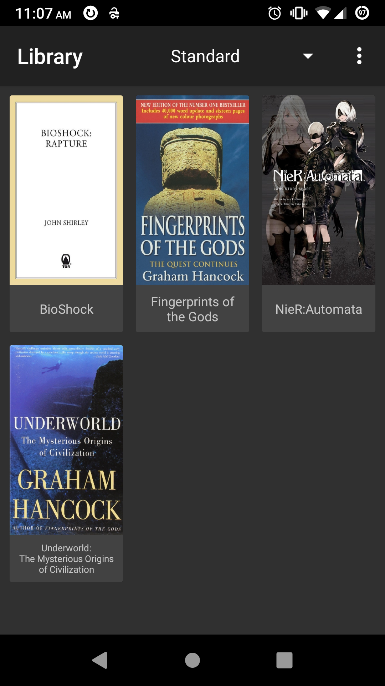
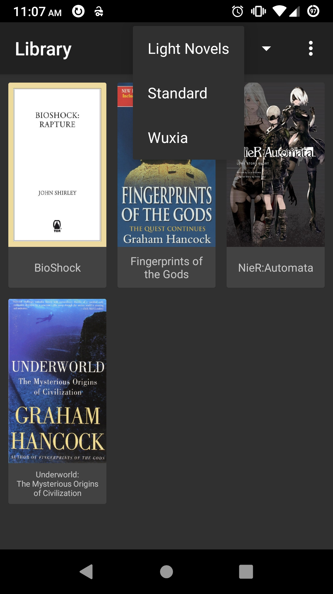
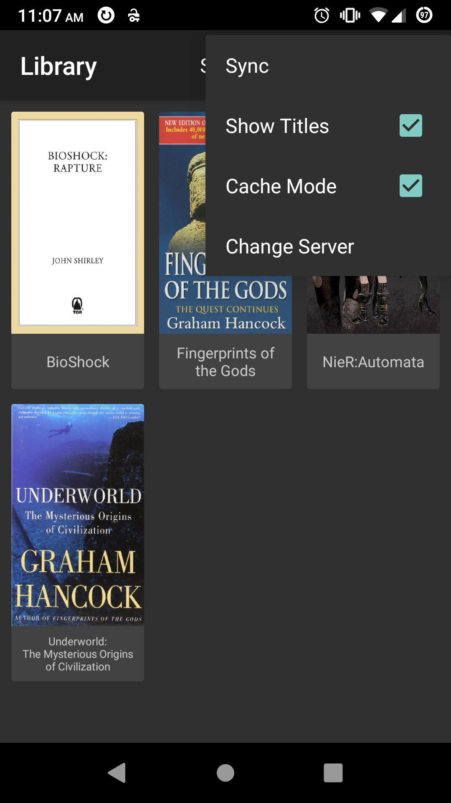
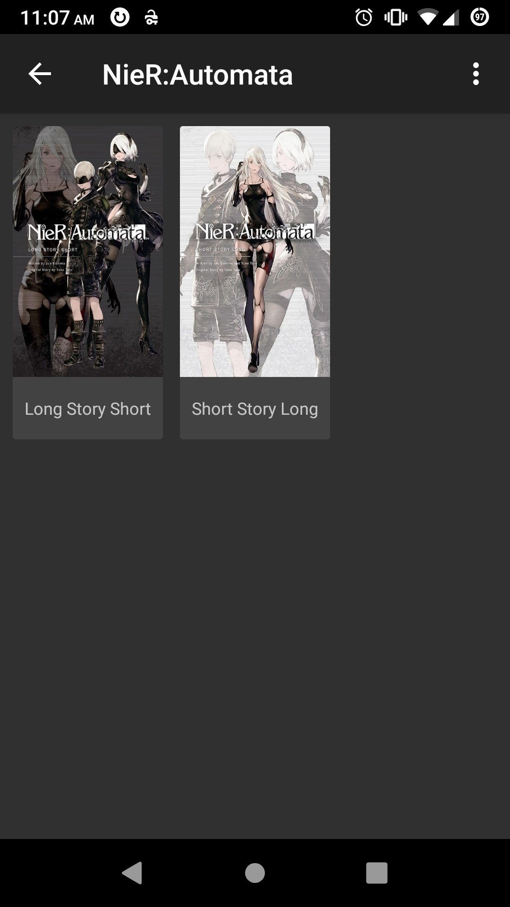
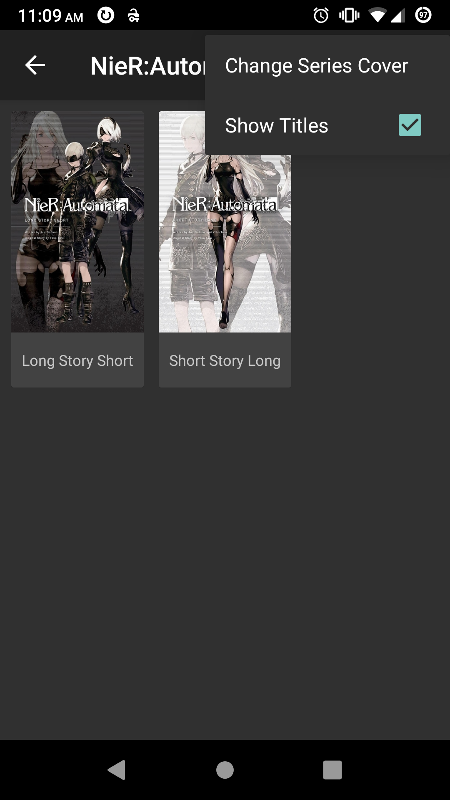
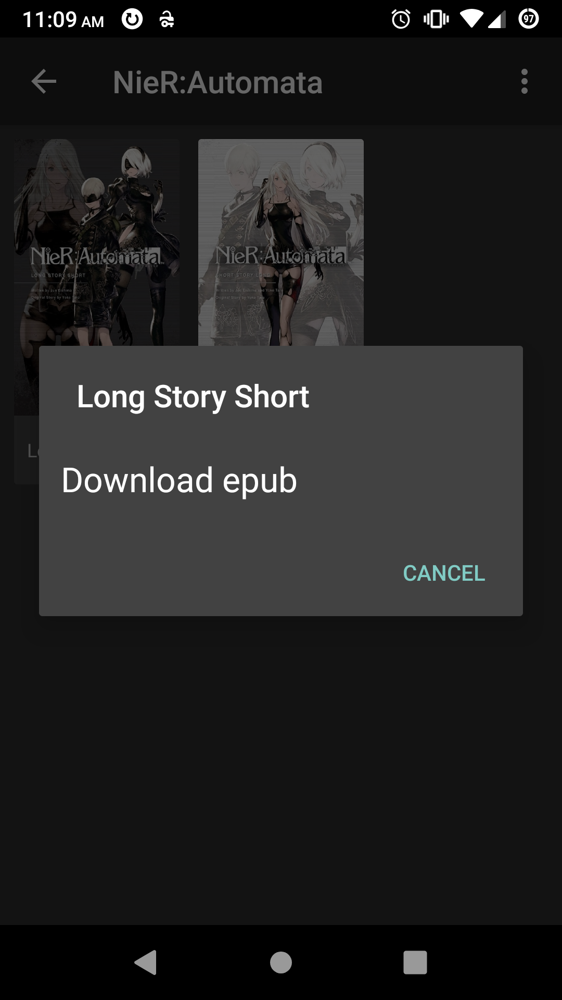
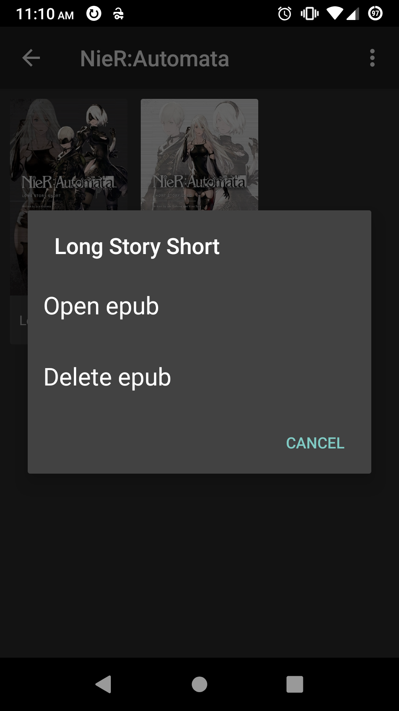

# Calibre Viewer

A mobile application used to view/download from a Calibre library

A reading application is needed along-side this application.

This application is solely used for visual appeal and offline library viewing.

## Screenshots

  
  
  
  
  
  
  

## Plans

- The series cover view changer needs to be implemented
- Currently only series view is supported, could add support for (as a list view):
  - Newest
  - Title
  - Author
  - Languages
  - Publisher
  - Tags
- Currently files are only downloaded as epub/zip, we need to add:
  - MIMETYPE to file extension library
  - (Does this matter? The intent is sent with the MIMETYPE, is a file extension forced in reader apps?)
- A download queue is needed
  - Will enable us to add mass downloading
  - Also need to add mass deleting when we add this
- Backup/Restore functionality